Proyecto Final Infraestructura Computacional
Objetivo: Crear una solución utilizando virtualización para consolidar la infraestructura de una organización.

Descripción:
La organización cuenta con tres servidores tipo torre y ha adquirido un nuevo servidor tipo torre de mayores capacidades. Este nuevo servidor será usado para crear y gestionar tres contenedores que proporcionen los siguientes servicios:

Apache
MySQL
Nginx
La solución debe incluir:

Creación de imágenes Dockerfile para los contenedores.
Replicación de las imágenes utilizando Podman.
Configuración de tres RAIDs tipo 1, combinados con volúmenes lógicos (LVM) enlazados a los contenedores.
Pruebas funcionales de los servicios y volúmenes, incluyendo archivos web y bases de datos.
Documentación completa en una bitácora alojada en un repositorio GIT junto con los archivos de configuración.

Bitácora de Proyecto Final

1. Creación de Discos Duros
Primero, configuramos 9 discos duros en el nuevo servidor virtualizado:

Creamos 6 discos de 6 GB y 3 discos de 3 GB en el gestor de máquinas virtuales.
Asignamos estos discos al servidor virtual para que puedan ser usados en la configuración de RAIDs y volúmenes lógicos.
Nota: Los discos se utilizarán para implementar tres RAIDs tipo 1, necesarios para los volúmenes lógicos de los contenedores.
 

2. Creación de RAIDs
2.1 Verificación de discos creados
Usamos el comando lsblk en la máquina virtual para verificar que los 9 discos fueron reconocidos correctamente.
 
2.2 Configuración de RAIDs
Creamos tres RAIDs tipo 1 utilizando el comando mdadm:
RAID 1: Combina dos discos para proporcionar redundancia.
Repetimos el proceso para crear un total de tres RAIDs.

2.3 Verificación de RAIDs creados
Usamos el comando cat /proc/mdstat para confirmar que los RAIDs están activos y funcionando correctamente.

Relevancia: Los RAIDs tipo 1 aseguran redundancia de datos, lo cual es fundamental para la confiabilidad de los servicios

3. Creación de Volúmenes Lógicos

3.1 Creación de volúmenes físicos (PV)
Convertimos los RAIDs en volúmenes físicos (pvcreate) para que puedan ser usados en la creación de volúmenes lógicos.

3.2 Creación de Grupos de Volúmenes (VG)
Agrupamos los volúmenes físicos en tres Grupos de Volúmenes (vgcreate), uno para cada servicio (Apache, MySQL y Nginx).

3.3 Creación de Volúmenes Lógicos (LV)
Dentro de cada VG, creamos un volumen lógico (lvcreate) que se utilizará para los contenedores correspondientes

3.4 Formateo y montaje
Formateamos cada LV con el sistema de archivos ext4.
Creamos directorios específicos para montarlos y configuramos el archivo /etc/fstab para montaje automático.

3.5 Crear los directorios para montar los volumenes logicos

3.6 Verificamos que los volumenes logicos se hayan creado correctamente 

3.7 Configurar para que los volumenes logicos se monten automaticamente al iniciar el sistema

4. Creación de Imágenes Dockerfile

4.1 Creación de Dockerfile
Para cada servicio, creamos un archivo Dockerfile con configuraciones específicas:

4.2 Procedemos a configurar los Dockerfile con sus respectivas imagenes 

4.1.1 Apache:

Imagen base: httpd.
Configuración personalizada para alojar aplicaciones web.

Creacion de la imagen apache : 

4.1.2 MySQL:

Imagen base: mysql.
Variables de entorno para inicializar la base de datos con usuario y contraseña predeterminados.

Creacion de la imagen MySQL :

4.1.3 Nginx:

Imagen base: nginx.
Configuración como proxy inverso o balanceador de carga.

Creacion de la imagen Nginx :

4.3 Verificamos que las imagenes se hayan creado correctamente

5. Montar las Imágenes en los Volúmenes Lógicos
Cada contenedor fue configurado para utilizar el volumen lógico correspondiente:

5.1 Apache
Directorio /mnt/apache vinculado al contenedor de Apache.
Se alojaron archivos web para pruebas. 

5.2 MySQL
Directorio /mnt/mysql vinculado al contenedor de MySQL.
Se probaron operaciones con bases de datos para garantizar la persistencia.

5.3 Nginx
Directorio /mnt/nginx vinculado al contenedor de Nginx.
Se configuró como proxy inverso para los otros servicios.

6. Test de Funcionamiento

6.1 Apache
Probamos el contenedor accediendo desde un navegador web y verificando que los archivos web alojados en /mnt/apache fueran servidos correctamente.
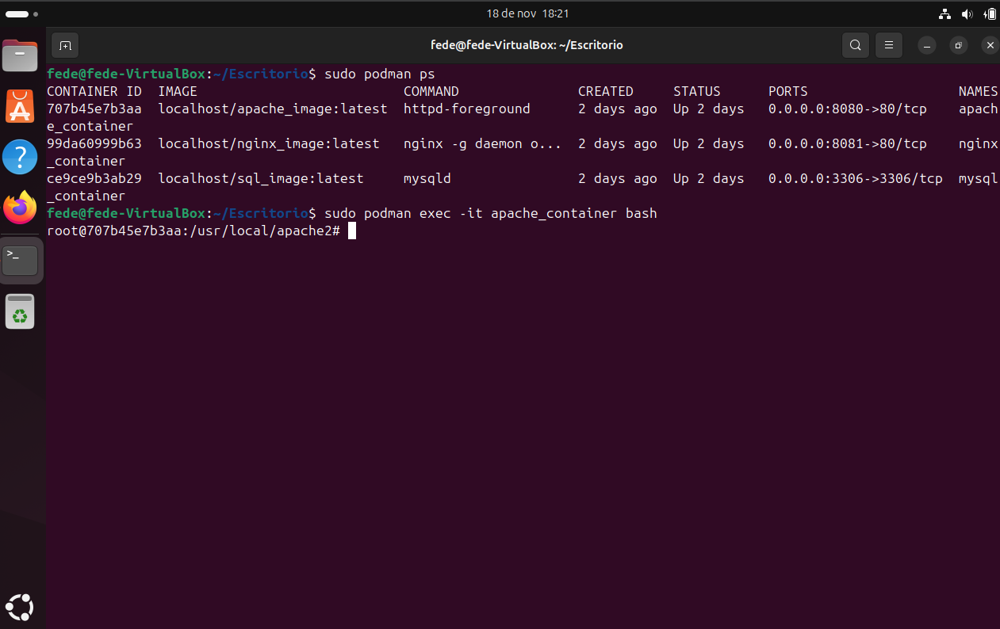
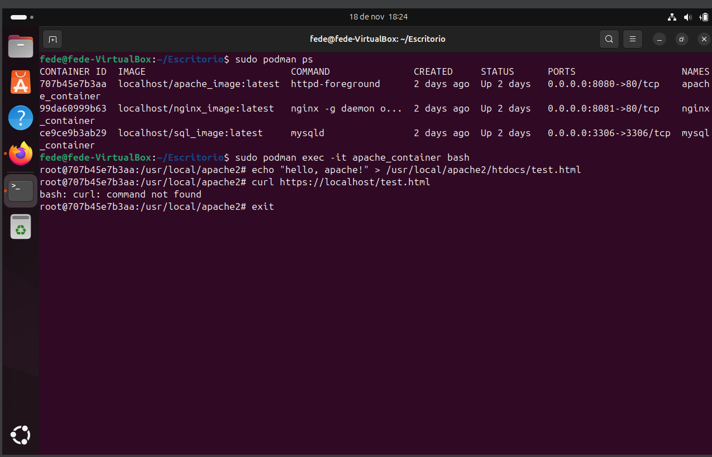
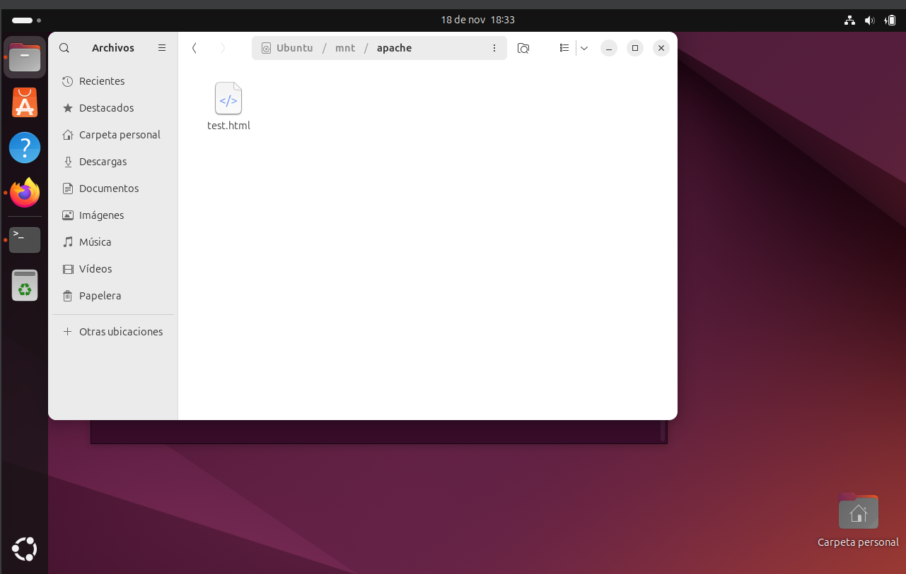
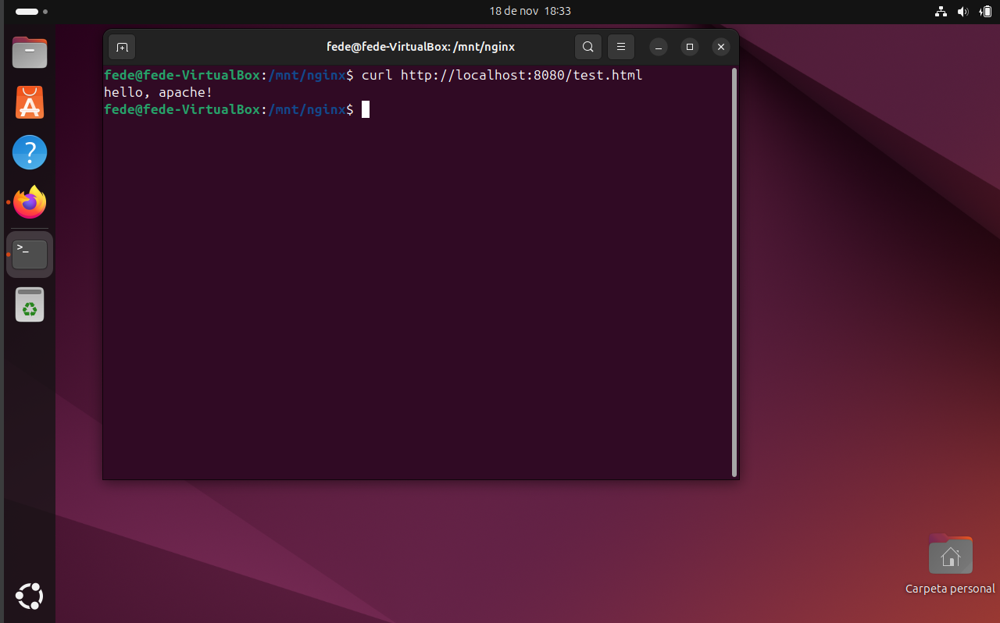

6.2 MySQL
Realizamos consultas SQL desde una aplicación cliente, verificamos la persistencia de datos tras reiniciar el contenedor y la VM.
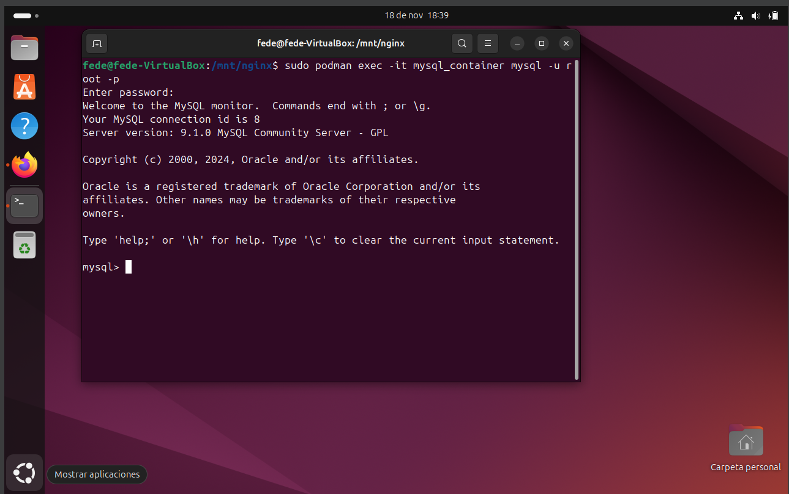
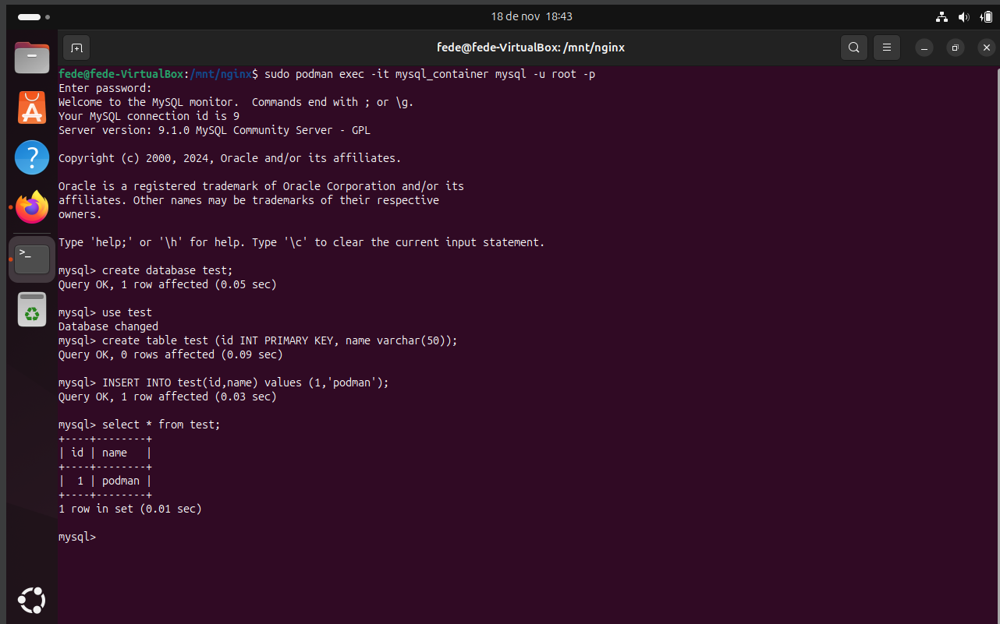
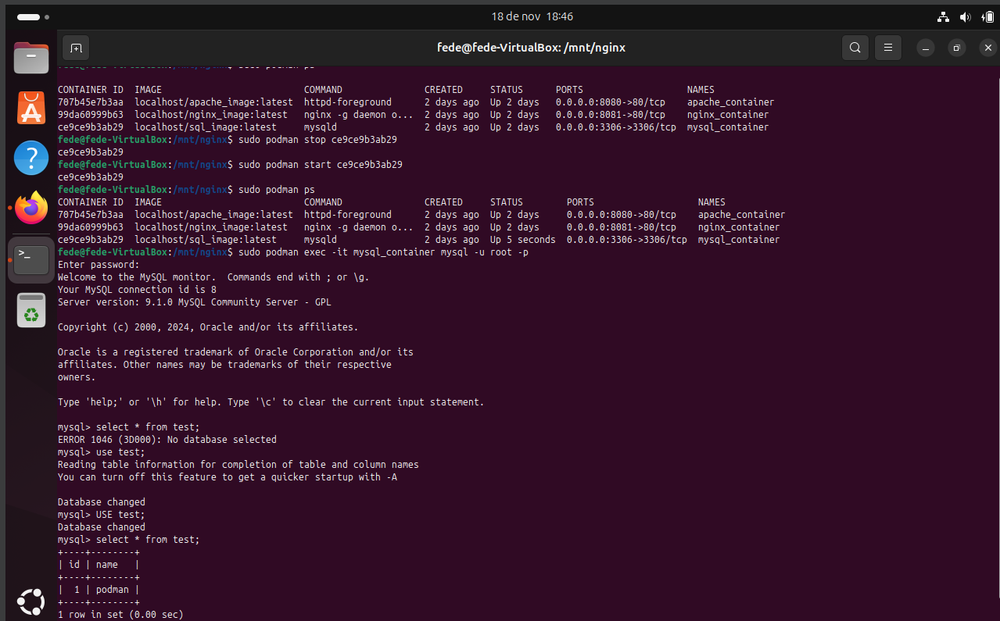

6.3 Nginx
Probamos la redirección y el balanceo de carga configurados en el contenedor.
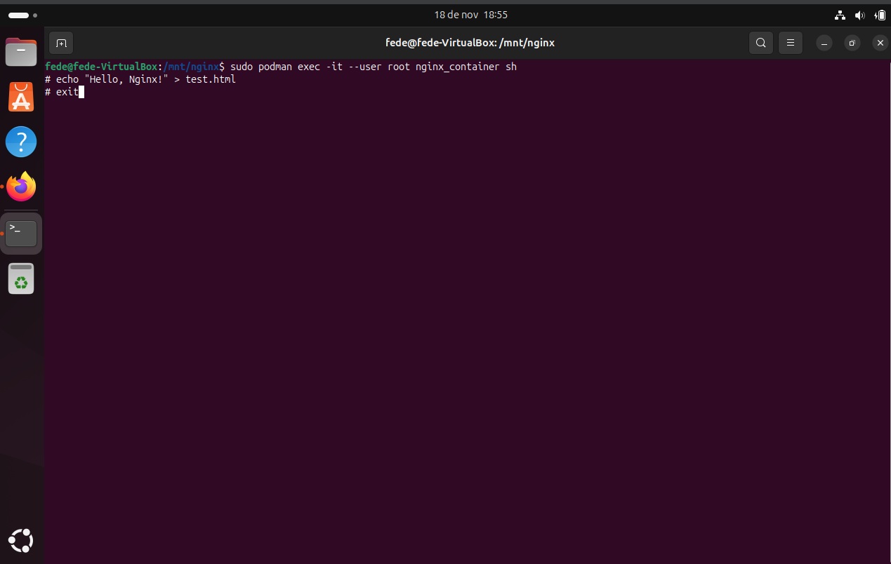
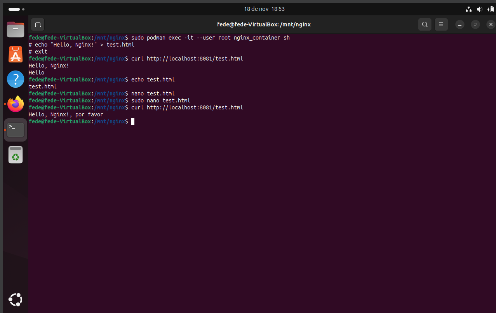
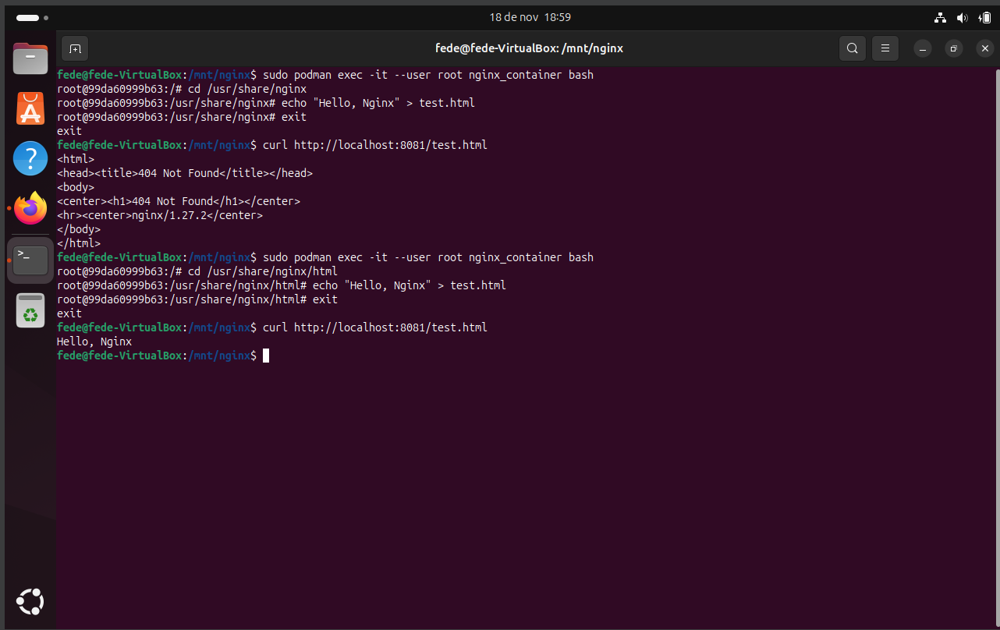

Verificación de persistencia
Reiniciamos los contenedores y la máquina virtual, confirmando que los datos y configuraciones persistieran gracias al uso de LVM y RAIDs.
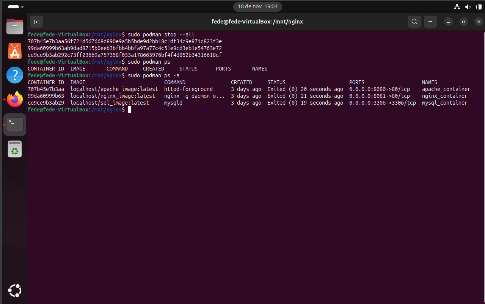
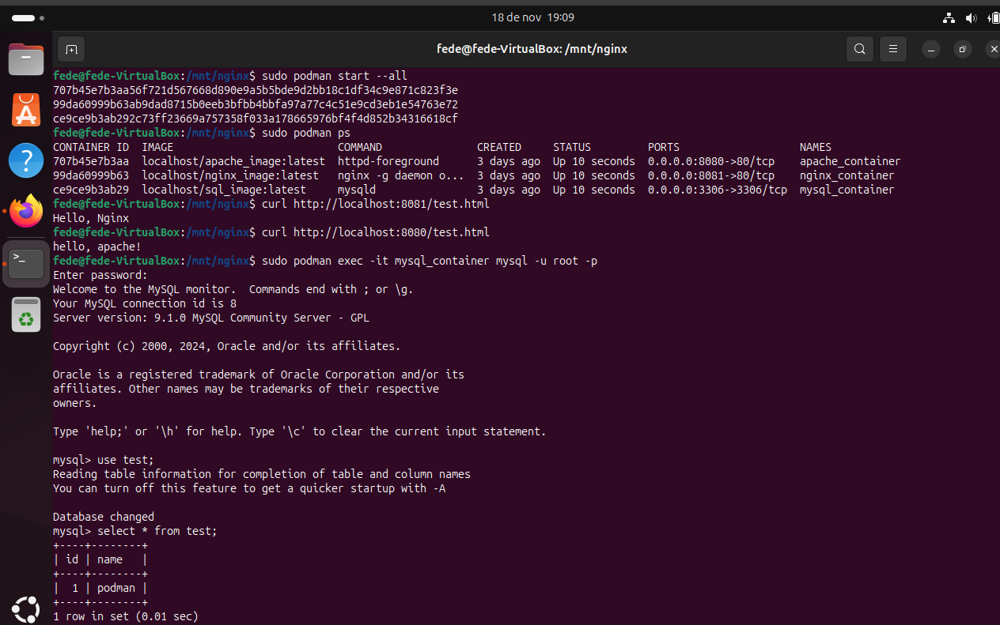

